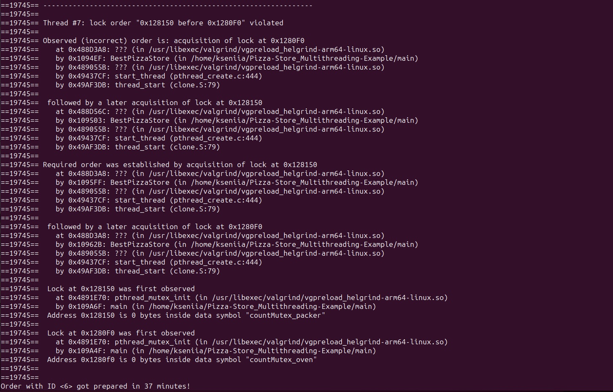

## Анализ кода, содержащий элементы параллельного программирования

Рассматриваемый проект [Pizza-Store_Multithreading-Example](https://github.com/kwsthsve/Pizza-Store_Multithreading-Example/tree/main)
 представляет собой синхронизацию "обработки" заказов в заведении за счет распаралелливания потоков. Исходный код написан на C и не содержит элементы библиотеки OpenMP.

Запустим программу с следующими аргументами:
``` 
$ gcc main.c -o main -lpthread
$ ./main 6 6
```
Чтобы отследить гонку данных в проекте, воспользуемся инструментами ThreadSanitizer и Helgrind.

## ThreadSanitizer
Проект с использованием ThreadSanitizer запускается следующей командой:
``` 
$ gcc main.c -fsanitize=thread -o main -lpthread
$ ./main 6 6
```

После запуска с ThreadSanitizer-ом, никаких предупреждений, измненения поведения или скорости выполнения программы,  другой интересной для нас информации этот инструмент не дал. Можно предположить, что все хорошо и гонки данных тут нет.

## Helgrind
Проект с использованием Helgrind запускается следующей командой:
``` 
$ gcc main.c -o main -lpthread
$ valgrind --tool=helgrind ./main 6 6
```
Этот инструмент уже дал нам некотрую полезную информацию.
```
==19745== ERROR SUMMARY: 21 errors from 21 contexts (suppressed: 1315 from 160)
```
Суммарно было 21 ошибки как на скрине ниже.


Предупреждение, как на скрине, сигнализирует о проблеме с кодом: либо выполняются ненужные операции с мьютексом, либо их порядок несогласован.


## Итог
- Использование только ThreadSanitizer-а не дает гарантии, что гонки данных в коде не возникнет
- Важно правильно подходить к логике выставления блокировок, так как такие ошибки в логике захвата и освобождения блокировок могут привести к не полной защите всех критических секций